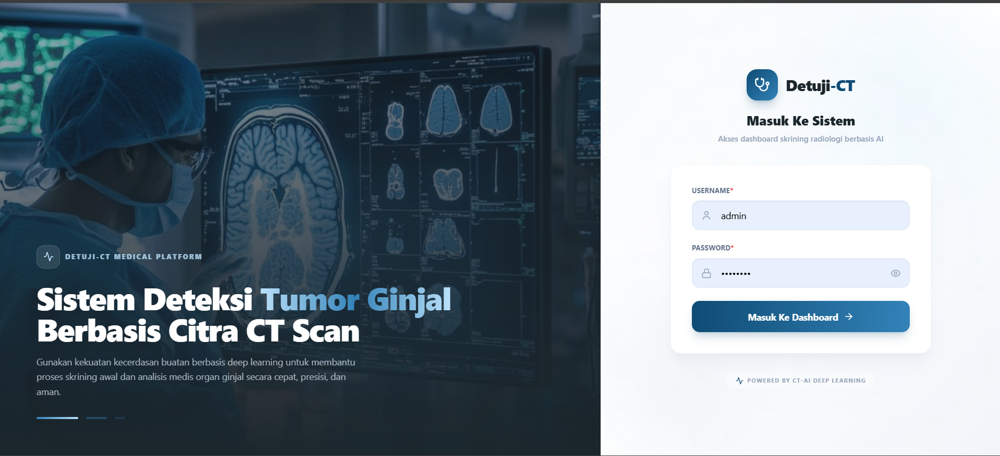
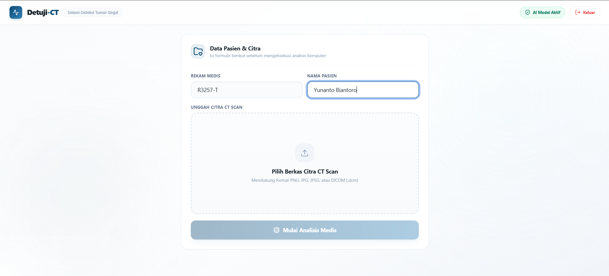
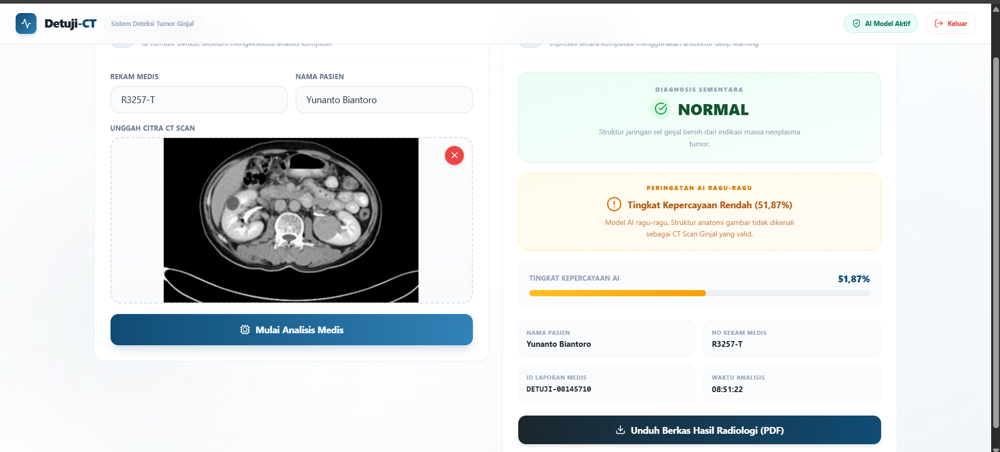
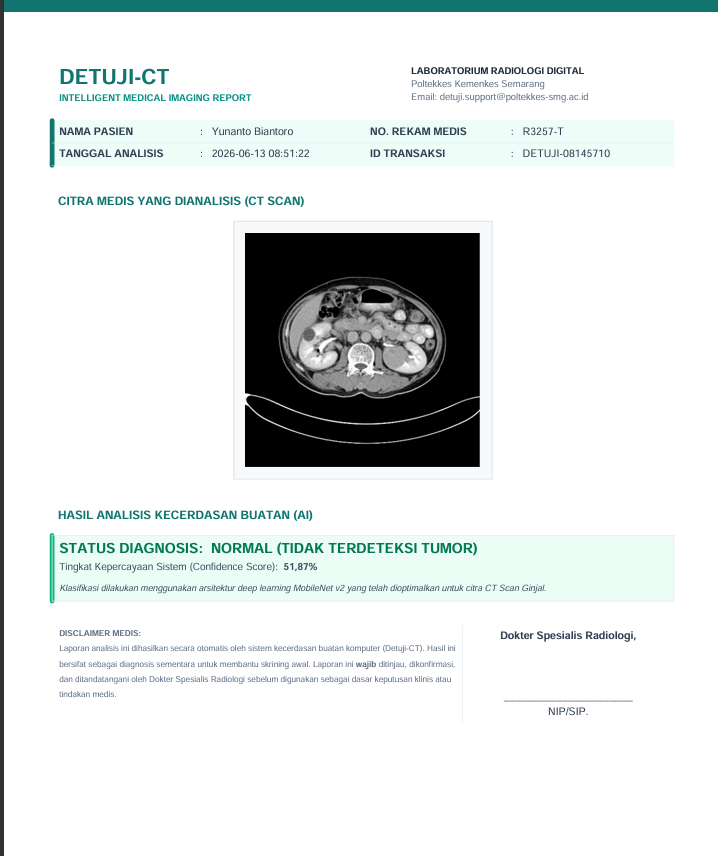

# <p align="center"><br>Detuji-CT</p>
<p align="center">
  <strong>Sistem Deteksi Tumor Ginjal Berbasis Deep Learning AI & Medical Imaging Analysis</strong>
</p>

<p align="center">
  
  
  
  
  
  
</p>

---

## 🌟 Tentang Detuji-CT

**Detuji-CT** adalah platform asisten medis berbasis kecerdasan buatan (AI) yang dirancang untuk mendeteksi keberadaan tumor ginjal melalui citra pemindaian **CT Scan**. Menggunakan arsitektur *Deep Learning* yang dilatih dengan ribuan data klinis, sistem ini mampu menganalisis struktur sel dan memberikan diagnosis sementara secara cepat dengan tingkat kepercayaan tinggi.

Sistem ini dirancang khusus untuk membantu radiolog dan tenaga medis dalam mempercepat alur kerja diagnosis klinis secara aman, terintegrasi, dan mudah digunakan.

---

## 🚀 Fitur Utama

*   🔒 **Sistem Autentikasi Aman:** Modul login terproteksi untuk memastikan data medis pasien hanya diakses oleh tenaga ahli yang berwenang.
*   🧠 **Deteksi AI Presisi Tinggi:** Menggunakan model Deep Learning (TensorFlow/Keras) untuk mengklasifikasikan CT Scan menjadi kategori **Normal** atau **Tumor**.
*   📂 **Dukungan Format Medis Multi-Format:** Mendukung format gambar standar (`.png`, `.jpg`, `.jpeg`) serta format standar medis **DICOM** (`.dcm`).
*   ⚡ **Animasi Laser Scanning Real-Time:** UI yang dinamis dengan visualisasi pemindaian holografik saat mesin AI menganalisis citra organ.
*   📊 **Dashboard Analisis Komprehensif:** Menyajikan skor tingkat kepercayaan model (*Confidence Level*), diagnosis sementara, ID laporan otomatis, dan riwayat pindaian.
*   📄 **Unduh Laporan Radiologi PDF:** Menghasilkan dokumen laporan resmi berekstensi PDF yang berisi detail diagnosis, informasi pasien, tanda tangan AI, serta metadata radiologi siap cetak.

---

## 📸 Antarmuka Pengguna (Screenshots)

Berikut adalah visualisasi antarmuka premium dari aplikasi **Detuji-CT**:

<p align="center">
  <strong>1. Halaman Autentikasi Keamanan</strong><br>
  
</p>

<p align="center">
  <strong>2. Dashboard & Form Pasien</strong><br>
  
</p>

<p align="center">
  <strong>3. Hasil Pemindaian & Analisis AI</strong><br>
  
</p>

<p align="center">
  <strong>4. Dokumen Laporan Radiologi (PDF)</strong><br>
  
</p>

---

## 🛠️ Tech Stack & Library

### Frontend
*   **Framework:** Next.js 14 (App Router)
*   **Styling:** Tailwind CSS (Modern Glassmorphism Design Theme)
*   **Icons:** Lucide React
*   **State Management:** React Hooks (useState, useEffect)

### Backend
*   **Framework:** Flask (Python)
*   **AI Engine:** TensorFlow 2.20 & Keras
*   **Image Processing:** OpenCV & Pillow (PIL)
*   **Medical Files Parser:** PyDicom, pylibjpeg
*   **PDF Generator:** ReportLab
*   **WSGI Server:** Gunicorn

---

## ⚙️ Cara Menjalankan Project Secara Lokal

### 1. Prasyarat (Prerequisites)
Pastikan Anda sudah menginstal:
*   [Node.js (versi 18+)](https://nodejs.org/)
*   [Python (versi 3.10+)](https://www.python.org/)
*   [Git](https://git-scm.com/)

---

### 2. Konfigurasi & Menjalankan Backend (Flask)

1. Masuk ke folder backend:
   ```bash
   cd ../backend
   ```
2. Buat Virtual Environment (opsional tapi disarankan):
   ```bash
   python -m venv venv
   # Aktifkan virtual environment
   # Windows:
   .\venv\Scripts\activate
   # Linux/MacOS:
   source venv/bin/activate
   ```
3. Instal semua dependensi:
   ```bash
   pip install -r requirement.txt
   ```
4. Jalankan server backend:
   ```bash
   python app.py
   ```
   *Backend akan berjalan secara default di `http://localhost:5002` (atau port lain sesuai konfigurasi `.env`).*

---

### 3. Konfigurasi & Menjalankan Frontend (Next.js)

1. Masuk ke folder frontend:
   ```bash
   cd ../frontend
   ```
2. Instal semua dependensi Node:
   ```bash
   npm install
   ```
3. Jalankan server development:
   ```bash
   npm run dev
   ```
4. Buka browser Anda dan akses `http://localhost:3000`.

---

## 🐳 Deployment (Docker Compose)

Proyek ini telah dikonfigurasi untuk dapat berjalan di server produksi menggunakan **Docker**. Untuk menjalankan seluruh layanan (Frontend & Backend) dalam satu perintah:

```bash
docker compose build --build-arg NEXT_PUBLIC_API_URL=http://<IP_VPS_ANDA>:5002
docker compose up -d
```

*Untuk panduan lengkap mengenai cara hosting dan konfigurasi port VPS, silakan merujuk pada berkas [PANDUAN_DEPLOY_VPS.md](../PANDUAN_DEPLOY_VPS.md).*

---

<p align="center">
  Dibuat dengan ❤️ untuk kemajuan Teknologi Kesehatan dan Diagnostik Medis.
</p>

